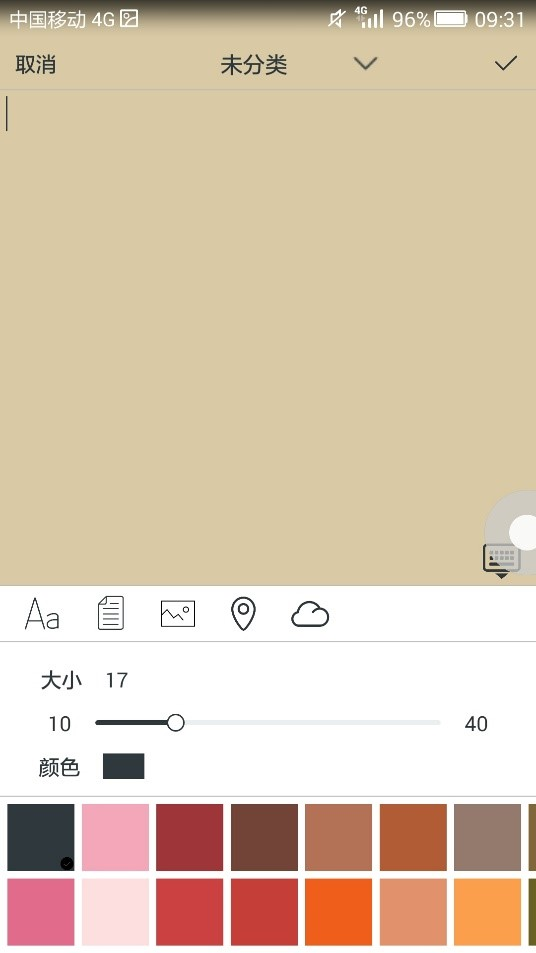

# Android_Time
一个Android 程序，前前后后大概六千行代码，仿写的是IOS端软件 ‘吾记’ 。API最低支持到19 。三星，华为，小米手机使用效果基本一致。

### 实现功能

 -（1）编辑文章
	 - 1.1 修改字体颜色和大小
	 - 1.2 修改整体背景
	 - 1.3 查看天气信息
	 - 1.4 选择同步到服务器端
	 - 1.5 选择天气情况
	 - 1.6 选择图片或则拍照获取图片
	 - 1.7 选择分类
 -（2）查看文章
	 - 2.1 查看文章列表
	 - 2.2 查看文章详情
	 - 2.3 点击切换按钮左右切换
	 - 2.4 点击删除按钮删除
 - （3）分类
	 - 3.1编辑分类
	 - 3.2可按分类查找文章
 - （4）登录 注册
 - （5）公共板块
	 - 5.1查看大家发布的文章列表
	 - 5.2 查看公共公文章详情
	 - 5.3 记录该文章浏览数量
	 - 5.4 点赞某篇文章，不可撤回
 - （6）个人
	 - 6.1 设置图像图片并上传到服务器 立即刷新
	 - 6.2 设置背景图片并上传到服务器 立即刷新
   	 - 6.3 修改昵称和签名

### 界面
	
	- 1.1 修改字体颜色和大小
		
